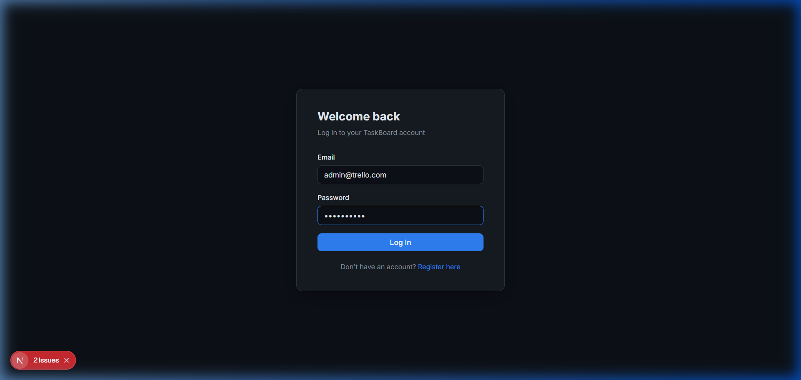
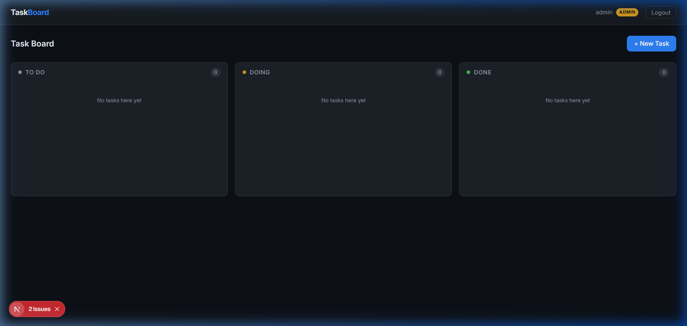

# Trello Clone

A full-stack task management application built for a Software Engineering Intern technical assignment. It features a Kanban-style board with drag-and-drop functionality, user authentication, and role-based access control.

## Tech Stack
- **Frontend:** Next.js (React), CSS, `@hello-pangea/dnd` for drag-and-drop
- **Backend:** Node.js, Express
- **Database:** MongoDB (Mongoose)
- **Authentication:** JWT & bcryptjs

## Features
- **Authentication & Authorization:** Secure JWT-based login with hashed passwords. 
- **Roles:** 
  - **Normal Users:** Can register, login, create tasks, assign unassigned tasks to themselves, and manage the status of their own tasks.
  - **Administrators:** Have elevated privileges. Can view all users and tasks, and manage/reassign tasks across the entire system.
- **Task Management:** Tasks include title, description, status (To Do, Doing, Done), creator, assignee, and timestamps.
- **Drag-and-Drop:** Intuitive Kanban board for moving tasks between statuses, with state persisting to the database.

## Local Setup

### 1. Backend Setup
```bash
cd backend
npm install
```

Create a `.env` file in the `backend` directory (see `.env.example` for reference):
```
PORT=5000
MONGO_URI=your_mongodb_connection_string
JWT_SECRET=your_jwt_secret
ALLOWED_ORIGIN=http://localhost:3000
```

Start the backend:
```bash
node server.js
```

### 2. Frontend Setup
```bash
cd frontend
npm install
```

Create a `.env.local` file in the `frontend` directory:
```
NEXT_PUBLIC_API_URL=http://localhost:5000/api
```

Start the frontend:
```bash
npm run dev
```

## Administrator Account
The admin account is pre-seeded in the database to prevent unauthorized administrative registration. 
- **Email:** admin@trello.com
- **Password:** Admin@1234

## Application Screenshots
- **Login/Registration Page**: 
- **Task Board (Administrator)**: 
